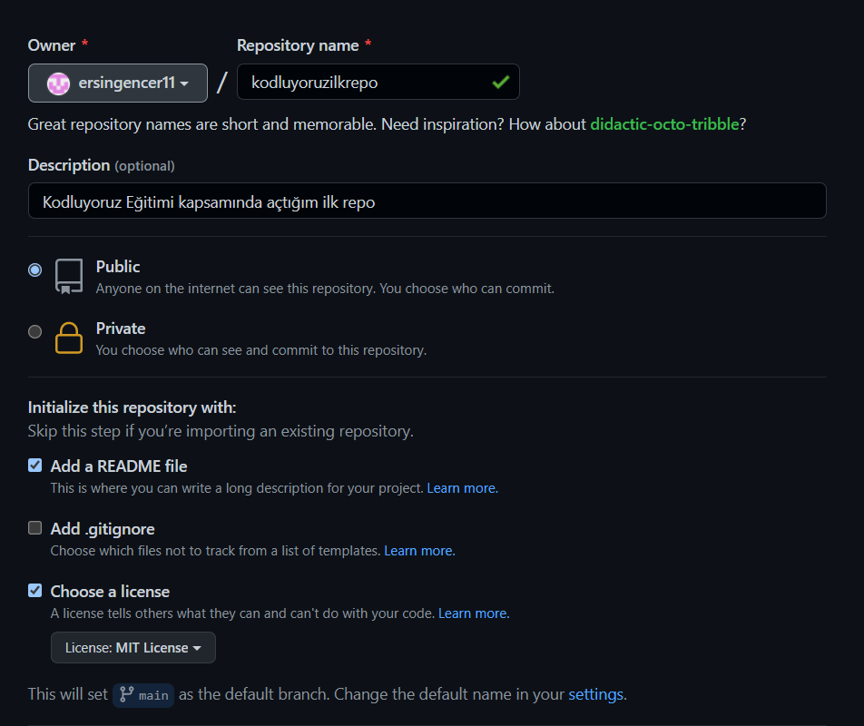

# Kodluyoruz ilk repo
Bu repo [kodluyoruz](https://www.kodluyoruz.org/) Front-end eğitimimizde oluşturduğumuz ilk repo. İçerisinde bir adet README dosyası, bir adet de index.html barındırıyor.

## Installation
---
`git clone https://github.com/ersingencer11/kodluyoruzilkrepo.git`

## Usage
---
Projeyi cloneladıktan sonra Visual Studio Code programında açınız.

Linux için:

`cd kodluyoruzilkrepo`
 
 `code .`

## Contributing
---
Pull requestler kabul edilir. Büyük değişiklikler için, lütfen önce neyi değiştirmek istediğinizi tartışmak için bir konu açınız.
## License
---
[MIT](https://choosealicense.com/licenses/mit/)